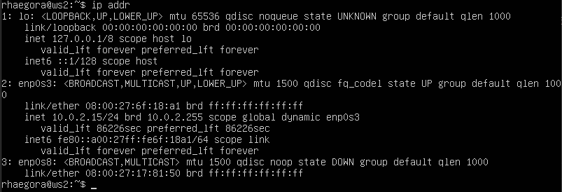
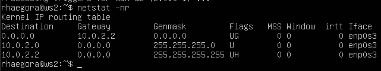
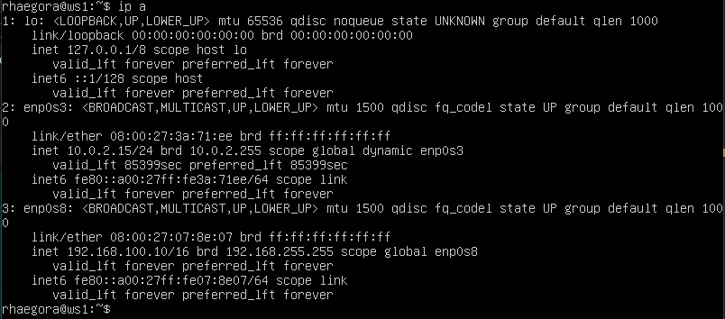
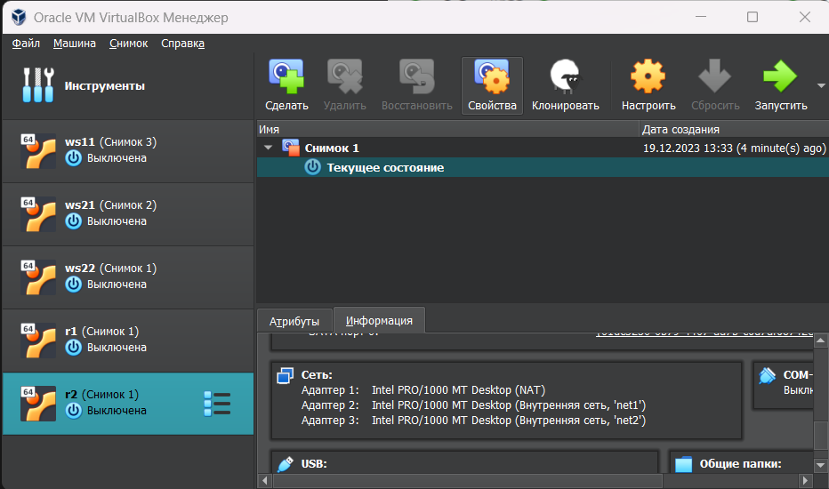
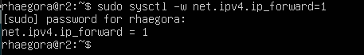
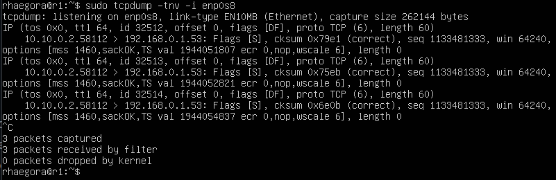
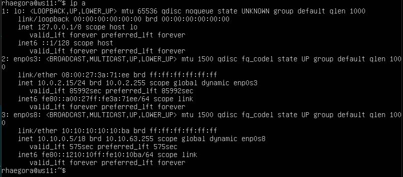

## Part 1. Инструмент ipcalc

### Поднять виртуальную машину (далее -- ws1)
* Подняли виртуальную машину на Ubuntu 20.04 Server LTS с именем ws1, выполнив команду `cat /etc/issue`:  
  

* Устанавливаем инструмент ipcalc командной `sudo apt install ipcalc`:  
  

1.1. Сети и маски
Определяем и запишем в отчёт:
1) адрес сети 192.167.38.54/13 --> 192.160.0.0/13 (Network)  
  

- **Расшифровка строк:**
    1. **Address: 192.167.38.54**
    Предоставленный IP-адрес: 192.167.38.54.
    2. **Netmask: 255.248.0.0 = 13**
    Это маска подсети в двоичной и десятичной форме. В данном случае маска подсети /13, что означает, что первые 13 битов установлены в 1, а остальные - в 0. В двоичной форме: 11111111.11111000.00000000.00000000.
    3. **Wildcard: 0.7.255.255**
    Это обратная маска (wildcard) подсети. Она обратно соответствует маске подсети и используется для определения возможных хостовых адресов в подсети.
    4. **Network: 192.160.0.0/13**
    Это адрес сети, который получается применением маски подсети к вашему IP-адресу. Это первый адрес в данной подсети.
    5. **HostMin: 192.160.0.1**
    Это минимальный адрес хоста в данной подсети. Он следует за адресом сети.
    6. **HostMax: 192.167.255.254**
    Это максимальный адрес хоста в данной подсети. Это последний адрес, который можно использовать для хостов в данной подсети.
    7. **Broadcast: 192.167.255.255**
    Это широковещательный адрес для данной подсети. Это последний адрес в подсети и используется для передачи сообщений всем хостам в этой подсети.
    8. **Hosts/Net: 524286**
    Это количество хостовых адресов, которые доступны в данной подсети для присвоения устройствам. В данном случае, подсеть имеет возможность вместить до 524286 хостов.
    9. **Class C**
    Это указание класса адреса подсети. В данном случае, адрес принадлежит к классу C.
    
    **Класс A**: Начинается с бита "0", используется для больших сетей.
    
    **Класс B**: Начинается с битами "10", используется для средних сетей.
    
    **Класс C**: Начинается с битами "110", используется для маленьких сетей.

2) перевод маски 255.255.255.0 в префиксную и двоичную запись, /15 в обычную и двоичную 11111111.11111111.11111111.11110000 в обычную и префиксную  
  
* маска 255.255.255.0 = перфиксная запись "/24", в двоичная запись = "11111111.11111111.11111111.00000000";
* маска "/15" в десятичной и двоичной записи: "255.254.0.0"; "11111111.11111111.00000000.00000000"
* маска "11111111.11111111.11111111.11110000" в обычной и префиксной
в десятичном формате - "255.255.255.240"

3) минимальный и максимальный хост в сети 12.167.38.4 при маске /8 (12.0.0.1 - 12.255.255.254)  
  
12.167.38.4 при маске /8

  при маске 11111111.11111111.00000000.00000000 (12.167.0.1 - 12.167.255.254) (12.167.0.1 - 12.167.255.254) 
    
  12.167.38.4 при маске 11111111.11111111.00000000.00000000

  при маске 255.255.254.0 (12.167.38.1 - 12.167.39.254) 
    
  12.167.38.4 при маске 255.255.254.0

  при маске /4 ( 0.0.0.1 - 15.255.255.254) 
    
  12.167.38.4 при маске /4

1.2. localhost
Приложение, работающее на localhost, означает, что приложение запущено и функционирует на том же компьютере (или сервере), с которого производится запрос к нему.

Такое приложение использует сетевой адрес ***127.0.0.0/8***, который является специальным адресом для обратной связи на компьютере. Весь трафик, направленный на этот адрес, остается внутри компьютера и не покидает его сетевой интерфейс.

Для того, чтобы определить, можно ли обратиться к приложению, работающему на localhost, со следующими IP: *194.34.23.100*, *127.0.0.2*, *127.1.0.1*, *128.0.0.1,* пропингуем эти адреса: 
  
проверка приложений на localhost

* Итог: рабочие IP для приложений на localhost - 127.0.0.2 и 127.1.0.1.

1.3. Диапазоны и сегменты сетей
- **Частные и публичные IP-адреса**
    
    **Частные IP-адреса**  используются внутри частных сетей, таких как домашние сети или корпоративные внутренние сети. Они не маршрутизируются напрямую в интернете и используются для связи внутри ограниченной сети. Это помогает управлять адресным пространством и уменьшить количество уникальных IP-адресов, которые требуются.
    
    Следующие диапазоны адресов зарезервированы для частных ( LAN —Local Area Network) сетей:
    
    - *10.0.0.0 - 10.255.255.255 (10.0.0.0/8)*
    - *172.16.0.0 - 172.31.255.255 (172.16.0.0/12)*
    - *192.168.0.0 - 192.168.255.255 (192.168.0.0/16)*
    - *127.0.0.0 - 127.255.255.255* —
        
    Зарезервировано для петлевых интерфейсов (не используется для связи между узлами сети) — localhost
        
    
    Эти адреса могут быть использованы внутри сети для назначения устройствам, но они не могут напрямую использоваться в интернете. Для связи между частной сетью и интернетом обычно используется NAT (Network Address Translation), который позволяет переводить частные IP-адреса в общедоступные IP-адреса.
    
    **Публичные IP-адреса:**
    Публичные IP-адреса используются для идентификации устройств в интернете. Они уникальны и могут быть использованы для связи с другими устройствами в глобальной сети. Публичные IP-адреса требуются для серверов, веб-сайтов, облачных услуг и других устройств, доступных из интернета. 
    Публичные IP-адреса присваиваются организациями провайдерами интернет-услуг или другими ресурсами, управляющими адресным пространством.
    

1) В качестве публичных можно использовать следующие адреса: *134.43.0.2, 172.0.2.1*, *192.172.0.1*,  *172.68.0.2*, *192.169.168.1.*
В качестве частных: *10.0.0.45, 192.168.4.2*, *172.20.250.4*, *172.16.255.255*, *10.10.10.10.*

2) Какие из перечисленных IP адресов шлюза возможны у сети *10.10.0.0/18*: *10.0.0.1*, *10.10.0.2*, *10.10.10.10*, *10.10.100.1*, *10.10.1.255?*
посмотрим расчет сети с помощью `ipcalc` для *10.10.0.0/18*  
 
расчет сети для 10.10.0.0/18

**Шлюз должен иметь IP-адрес, который находится в том же диапазоне, что и IP-адреса устройств в данной сети.**

Таким образом, у сети *10.10.0.0/18*   возможны следующие IP адреса шлюза: *10.10.0.2, 10.10.10.10*, *10.10.1.255* (входят в диапазон)*.*
Адреса *10.0.0.1* и *10.10.100.1* являются частью другой сети.

## Part 2. Статическая маршрутизация между двумя машинами
* Подняли вторую виртуальную машину на Ubuntu 20.04 Server LTS с именем ws2 
  
подняли виртуальную машину ws2

У обеих машин в настройках сети, “Адаптер 2” выбираем “Внутренняя сеть” и выбираем/задаем имя (имя внутренней сети должно быть одинаковое у обеих машин). 
  
настройка внутренней сети

С помощью команды `ip addr` выведем существующие сетевые интерфейсы 

  
сетевые интерфейсы на машине ws1

  
сетевые интерфейсы на машине ws2

Видно, что у обеих машин по 3 интерфейса. Третий из них - для внутренней сети - не активирован.

- **Описание интерфейсов**
    1. **lo (Loopback):** Этот интерфейс является "петлей обратной связи" и используется для локальных коммуникаций внутри самого устройства. В данном случае, у него есть IPv4-адрес 127.0.0.1 и IPv6-адрес ::1, что позволяет устройству обращаться к самому себе.
    2. **enp0s3:** Это сетевой интерфейс, подключенный к виртуальной сети "NAT" в VirtualBox. Ему назначен динамический IPv4-адрес 10.0.2.15. Этот интерфейс используется для взаимодействия вашей виртуальной машины с внешним миром через NAT-маршрутизацию.
    3. **enp0s8:** Этот сетевой интерфейс находится в состоянии DOWN, что означает, что он не активирован.

Описать сетевой интерфейс, соответствующий внутренней сети, на обеих машинах и задать следующие адреса и маски: ws1 - 192.168.100.10, маска /16, ws2 - 172.24.116.8, маска /12
С помощью следующей команды ip route или netstat проверяем адреса машин
`netstat -nr`
* -n - отбражение адресов в числовом виде;
* -r - отображение в виде таблицы.

ws1   

ws2   

Используем следующую команду для открытия файла и установки в нём статического адреса:
`sudo vim /etc/netplan/00-installer-config.yaml`

etc/netplan/00-installer-config.yaml - файл который нужно отредактировать на каждой машине. Этот файл отвечает за настройку интерфейсов сети.
Этот файл на обеих машинах сначала выглядит одинаково

Чтобы активировать сетевой интерфейс на обеих машинах:

1) В файле *etc/netplan/00-installer-config.yaml* опишем сетевой интерфейс, соответствующий внутренней сети: добавляем **адреса и маски для обеих машин. 
  
ws1 - *192.168.100.10*, маска */16* 

  
ws2 - *172.24.116.8*, маска */12* 

2) После внесения изменений вызываем команду sudo netplan apply , чтобы применить изменения, внесенные в конфигурационные файлы.

ws1 - применение настроек сети 
  
ws2 - применение настроек сети 
  

ws1 - enp0s8 - настройки изменились 
  
ws2 - enp0s8 - настройки изменились 
  

2.1 Добавление статического маршрута вручную
Команда `ip r add` используется для добавления пользовательских маршрутов в таблицу маршрутизации, позволяет вручную настроить, каким образом пакеты будут направляться к определенным сетям или хостам.
`sudo ip route add <сеть/хост> via <шлюз> dev <интерфейс>`
​
Где:
* <сеть/хост>: Целевая сеть или IP-адрес хоста - КУДА
* <шлюз>: IP-адрес шлюза (маршрутизатора), через который пакеты будут направляться к указанной сети/хосту - ОТКУДА
* <интерфейс>: Имя сетевого интерфейса, через который будут отправляться пакеты к указанной сети/хосту.

Для ws1 вызовем команду
`sudo ip r add 172.24.116.8 via 192.168.100.10 dev enp0s8`, 
добавив статический маршрут до ws2
  
добавили статический маршрут ws1 - ws2

Для ws2 вызовем команду 
sudo ip r add 192.168.100.10 via 172.24.116.8 dev enp0s8 , 
добавив статический маршрут до ws1
  
добавили статический маршрут ws2 - ws1

Пропингуем соединение с помощью `ping -c 5` на обеих машинах 

  
ping ws1 - ws2

  
ping ws2 - ws1

- **2.2 Добавление статического маршрута с сохранением**
    
    Так как команда **`ip r add`** используется для добавления временного (не постоянного) маршрута в таблицу маршрутизации, добавим маршрут так, чтобы он сохранялся при перезагрузке системы.
    
    Перезапустим машины `sudo reboot` и добавим статический маршрут от одной машины до другой с помощью файла *etc/netplan/00-installer-config.yaml.*
    
      
    добавили статический маршрут ws1 - ws2
    
      
    добавили статический маршрут ws2 - ws1
    
    После внесения изменений вызвана команда `sudo netplan apply` и пропинговано соединение между машинами. 
    
      
    ping ws1 - ws2
    
      
    ping ws2 - ws1

## Part 3. Утилита iperf3
* 3.1. Скорость соединения**
    
    Чтобы перевести скорость из мегабитов в секунду (Mbps) в мегабайты в секунду (MB/s), нужно разделить значение в мегабитах на 8, так как в 1 байте содержится 8 битов.
    
    - 8 Mbps == 1MB/s (/8)
    - 100 MB/s == 800 000Kbps 
    переводим мегабайты в мегабиты → 100MB/s * 8 == 800Mbps 
    переводим мегабиты в килобиты → 800Mbps * 1 000 = 800 000Kbps
    - 1 Gbps == 1 000Mbps (*1000)

* 3.2. Утилита iperf3
    Устанавливаем утилиту `sudo apt install iperf3`

ws1 будет выступать в роли сервера, поэтому выполняем команду `iperf3 -s` 
  
запуск ws1 в качестве сервера

ws2 будет выступать в роли клиента, выполняем команду iperf3 -c 192.168.100.10
Далее происходил обмен трафиком, и выведена средняя скорость передачи данных - 1.17Gbps 
  
результат работы утилиты iperf3 между машинами ws1-ws2

## Part 4. Сетевой экран
* iptables — это утилита брандмауэра командной строки, которая использует цепочки политик для разрешения или блокировки трафика. Когда соединение пытается установиться в системе, iptables ищет правило в своем списке, чтобы сопоставить его. Если утилита не находит нужного правила, она прибегает к действию по умолчанию.

Подсистема iptables и Netfilter уже достаточно давно встроена в ядро Linux. Все сетевые пакеты, которые проходят через компьютер, отправляются компьютером или предназначены компьютеру, ядро направляет через фильтр iptables. Там эти пакеты поддаются проверкам и затем для каждой проверки, если она пройдена выполняется указанное в ней действие. Например, пакет передается дальше ядру для отправки целевой программе, или отбрасывается.

    Статья о работе с утилитой iptables - https://www.dmosk.ru/instruktions.php?object=iptables-settings&ysclid=ll5c72d95e413511649
    
    Статья о том, как блокировать ping - https://linux-notes.org/razreshit-zablokirovat-ping-icmp-pakety-v-unix-linux/?ysclid=ll5faf5ngl552401707

* Командой sudo vim /etc/firewall.sh создаем файл, имитирующий фаерволл и открываем его для редактирования.  
Итого, файлы firewall.sh на машинах выглядят следующим образом: 
  
firewall.sh на ws1

  
firewall.sh на ws2
    
- **Расшифровка**
    - `A OUTPUT`: Опция `A` указывает на добавление правила в выбранную цепочку. `OUTPUT` - это имя цепочки, в которую добавляется правило. Цепочка OUTPUT используется для обработки исходящего трафика.
    - `p icmp`: Опция `p` указывает на протокол, к которому применяется правило. В данном случае, указывается ICMP - протокол управления сообщениями интернета.
    - `-icmp-type echo-reply`: Это опция, которая задает тип ICMP-пакета. `echo-reply` означает ответ на ICMP-запрос "ping" типа "echo".
    - `-j DROP`: Опция `-j` определяет действие, которое будет применено к пакетам, соответствующим правилу. `DROP` означает, что пакеты, удовлетворяющие этому правилу, будут блокированы (отбрасываться).
    
    Итого, данное правило добавляет правило в цепочку OUTPUT таблицы filter, которое отвергает (отклоняет) исходящие пакеты типа "echo-reply" ICMP, что означает, что ответы на "ping" будут отклонены. 
    
    `ACCEPT` будет означать, что пакеты, удовлетворяющие этому правилу, будут приниматься и передаваться дальше.

Запустим скрипты: `chmod +x /etc/firewall.sh` и `/etc/firewall.sh`
выведем результат их работы: `sudo iptables -L --line-numbers` 
и пропигуем обе машины. 

 
правила фильтрации трафика на ws1, ws2 пингуется

 
правила фильтрации трафика на ws1, ws2 не пингуется

Разница между стратегиями, примененными в первом и втором файлах, состоит в том, что в приоритет имеет правило, заданное первым. Именно поэтому ws1 пропинговать не получается, так как там первое правило - запрещающее, а ws2 можем, так у там первое правило - разрешающее.

* 4.2. Утилита nmap
Устанавливаем утилиту `sudo apt install nmap`.
Пингуем ws2 - ws1, видим, что отклика нет, после вызываем nmap 192.168.100.10 и видим, что хост машины запущен. 

 
результат проверки на то, что ws1 запущена, хоть и не пингуется

- **Сохранение дампов образов виртуальных машин**
    
    Дамп - состояние машины.
    
    Сохраняем текущее состояние в интерфейсе VirtualBox. 
    
     
    сохранение дампов образов виртуальных машин
    
     
    сохранение дампов образов виртуальных машин

## Part 5. Статическая маршрутизация сети

 

Подняли пять виртуальных машин: 3 рабочие станции (ws11, ws21, ws22) и 2 роутера (r1, r2) 

 
ВМ ws11, ws21, ws22, r1, r2

Подключала несколько адаптеров  (два - для рабочих станций, и три - для роутеров) при поднятии машин. У всех машин в первом адаптере выбран NAT (ему соответствует интерфейс enp0s3).

Подключала несколько адаптеров  (два - для рабочих станций, и три - для роутеров) при поднятии машин. У всех машин в первом адаптере выбран NAT (ему соответствует интерфейс enp0s3).

**ВАЖНО!** От каждого включенного адаптера создается один сетевой интерфейс. Они создаются по порядку: enp0s3 (от адаптера 1),  enp0s8 (от адаптера 2) и enp0s9 (от адаптера 3).

На картинке с заданием мы видим два интерфейса: eth0 и eth1. Им в нашем случае будут соответствовать интерфейсы enp0s8 (от адаптера 2) и enp0s9 (от адаптера 3).

!!!!! При поднятии машин обратить внимание, что у роутера r2 на картинке с заданием  интерфейс eth1 (то бишь enp0s9) метчится с машинами ws21 и ws22 через интерфейс eth0 (то бишь enp0s8) .
Поэтому, так как интерфейс enp0s9 соответствует адаптеру 3, а интерфейс enp0s8 соответствует адаптеру 2, то делаем вывод, что общая сеть для машин ws21, ws22 и r2 должна подключаться у r2 через адаптер 3, а у машин через адаптер 2.

Запускаем все ws и меняем на них имя хоста на соотвтетствующее:

для машины PC-ws11
`sudo hostnamectl set-hostname ws11`

для машины PC-ws21
`sudo hostnamectl set-hostname ws21`

для машины PC-ws22
`sudo hostnamectl set-hostname ws22`

для машины PC-r1
`sudo hostnamectl set-hostname r1`

для машины PC-r2
`sudo hostnamectl set-hostname r2`

 
задаем одинаковую внутреннюю сеть для машин r2, ws21, ws22 через адаптер №3 у r2 и через адаптер №2  у машин ws21 и ws22

- **5.1. Настройка адресов машин**
    
Используем команду sudo `vim /etc/netplan/00-installer-config.yaml`  
 
сетевые настройки ws11
    
 
сетевые настройки ws21
    
 
сетевые настройки ws22
    
 
сетевые настройки r1
    
 
сетевые настройки r2
    
Командой `sudo netplan apply` примененили изменения, внесенные в конфигурацию сети.
Проверяем, что настройки применены 
    
 
сетевые интерфейсы r2
    
Пингуем ws22 с ws21 
 
ping ws21 - ws22
    
Пингуем r1 с ws11 
 
ping ws11 - r1

 - **5.2. Включение переадресации IP-адресов**
    
Для включения переадресации выполняем команду на роутерах:
    
`sysctl -w net.ipv4.ip_forward=1` 
    
 
включена переадресация на r1
    
 
включена переадресация на r2
    
При выполнении вышеуказанной команды переадресация не будет работать после перезагрузки системы, поэтому в файле */etc/sysctl.conf*  расскомментируем следующую строку - `net.ipv4.ip_forward = 1` 

 
включение постоянной переадресации на r1 и r2 в файле */etc/sysctl.conf*

- **5.3. Установка маршрута по-умолчанию**
    
Настроим маршрут по умолчанию (шлюз) для рабочих станций, для этого добавим `default` перед IP роутера в файле конфигураций 
    
 
добавлен шлюз по умолчанию на ws11

 
добавлен шлюз по умолчанию на ws21

 
добавлен шлюз по умолчанию на ws22

После изменения настроек применяем команду для вступления в силу изменений

`sudo netplan apply`

Проверка, что маршрут добавился в таблицу маршрутизации  `ip r` 
 
добавлен шлюз по умолчанию на ws11

Для того, чтобы пропинговать с ws11 роутер r2,  используем команду 
`tcpdump -tn -i enp0s9`

- **Описание команды**
    
    Команда используется для захвата и вывода сетевого трафика на определенном сетевом интерфейсе с помощью утилиты `tcpdump` :
    
    - `tn`: Эти флаги указывают на определенные опции для форматирования вывода:
    - `t`: Отключает вывод времени, что означает, что временные метки пакетов не будут отображаться в выводе.
    - `n`: Отключает разрешение имен хостов и сервисов в IP-адреса и порты. Это полезно, если вы хотите видеть числовые IP-адреса и порты.
    - `i eth1`: Этот флаг указывает `tcpdump` на интерфейс, на котором нужно захватывать сетевой трафик. В данном случае, `eth1` - это имя сетевого интерфейса.
    
Таким образом, команда `tcpdump -tn -i eth1` захватывает сетевой трафик на интерфейсе `eth1` и выводит его в числовом формате, отключая при этом отображение временных меток и разрешение имен хостов и сервисов. 

Запускаем `tcpdump` на r2, чтобы отслеживать трафик на машине 
 
запустили tcpdump на r2

C ws11 начинаем пинговать r2  `ping -c 5 10.100.0.12` 
 
ping ws11 - r2

На r2 видим, что запросы получены  
 
echo request на r2

Роутер r2 получает запросы echo request , но ответ не отправляет, так как не прописан обратный адрес.

5.4. Добавление статических маршрутов

 
для r1 шлюзом в сеть 10.20.0.0 будет 10.100.0.12

 
добавлен статический маршрут для r1

 
для r2 шлюзом в сеть 10.10.0.0 будет 10.100.0.11

 
добавлен статический маршрут для r2

С помощью ip r убедимся, что статический маршрут добавлен 
 
сетевые маршруты r1 
 
сетевые маршруты r2 

**Запустить команды на ws11:**

Вызов команды `ip r list 10.10.0.0/18` выведет информацию о маршруте, связанном с конкретной подсетью.

Вызов команды `ip r list 0.0.0.0/0` используется для вывода информации о маршруте по умолчанию. Подсеть `0.0.0.0/0` представляет собой маршрут по умолчанию, который охватывает все возможные IP-адреса. Он указывает, как отправлять сетевой трафик, который не имеет явно заданного маршрута, или для которого не существует более конкретных маршрутов.

 
сетевые маршруты ws11

Для адреса 10.10.0.0/18 был выбран маршрут, отличный от 0.0.0.0/0, так как машина ws11 соединена с сетью 10.10.0.0/18 по своему IP-адресу 10.10.0.2, для других адресов используется маршрут по умолчанию, который указан в файле - 10.10.0.1.

- **5.5. Построение списка маршрутизаторов**
    - **Описание утилиты traceroute**
        
        Утилита `traceroute` используется для определения маршрута, по которому пакеты данных следуют от отправителя к получателю через сеть, и для вычисления времени, которое требуется для передачи данных между различными узлами сети → позволяет отслеживать "путь" пакетов через сеть, а также измерять задержки (пинг) на каждом промежуточном узле.
        
        `traceroute` также позволяет измерить время (задержку) между отправлением пакета и получением ответа от каждого узла. Это может помочь выявить узкие места или медленные участки в сети.
        
    
    Запускаем на r1 команду дампа `tcpdump -tnv -i enp0s8`
    
    Опции -tnv указывают `tcpdump` отобразить вывод в числовом формате, без разбора имен хостов и портов, и включить подробную информацию о пакетах. 
    
     
    
    запущена команда отслеживания сетевого трафика в реальном времени на r1
    
    На ws11 запустили `traceroute 10.20.0.10` 
    
     
    список маршрутизаторов на пути от ws11 до ws21

    Принцип работы утилиты `traceroute` основан на отправке сетевых **пакетов с TTL** и анализе ответов от промежуточных узлов сети. 
    
**Пакет данных с TTL**  означает сетевой пакет, в котором задано значение TTL, которое определяет количество промежуточных узлов, через которые пакет может проходить, прежде чем быть отброшенным. TTL является частью заголовка IP-пакета и используется для предотвращения зацикливания или бесконечного циркулирования пакетов в сети.
Вот как происходит построение пути при помощи `traceroute`:

1. Когда запускается `traceroute` к какому-либо адресу (IP-адресу или доменному имени), он начинает отправлять пакеты данных с TTL (Time To Live), установленным на 1, к указанному адресу. 
2. Первый узел (роутер) в сети, через который проходит пакет, уменьшает значение TTL на 1. Если после уменьшения значение TTL становится равным 0, узел отбрасывает пакет и отправляет обратно сообщение "Time Exceeded" обратно отправителю.
3. Отправитель `traceroute` записывает информацию о первом узле, через который прошел пакет, а затем увеличивает значение TTL на 1 и отправляет следующий пакет.
4. Процесс повторяется: каждый промежуточный узел уменьшает TTL, и если TTL достигает 0, он отправляет обратно сообщение "Time Exceeded". Отправитель записывает информацию об этом узле и переходит к следующему шагу.
5. Когда пакет наконец достигает финального пункта назначения (конечного IP-адреса), пункт назначения отправляет ответ "ICMP Echo Reply" (если протокол ICMP используется для пакетов), который достигает отправителя `traceroute`.
6. `traceroute` завершает свою работу, предоставляя список всех узлов (роутеров), через которые проходили пакеты, и информацию о времени, которое требовалось для прохождения каждого узла.
Таким образом, traceroute позволяет отследить маршрут, который пакеты данных проходят от отправителя к получателю через сеть, а также измерить задержки (пинг) на каждом промежуточном узле.

- **5.6. Использование протокола ICMP при маршрутизации**
    
    Запускаем на r1 перехват сетевого трафика `tcpdump -n -i enp0s8` 
    
     
    запущена команда отслеживания сетевого трафика в реальном времени на r1
    
    Пингуем с ws11 несуществующий IP с помощью команды`ping -c 1 10.30.0.111` 
     
    ping несуществующего адреса с ws11
    
    Видим, что `tcpdump` отловил запрос 
    
     
    tcpdump отловил запрос на r1
    
Сохраняем дампы образов виртуальных машин 
 
дампы образов виртуальных машин после выполнения задания №5

## 6. Динамическая настройка IP с помощью **DHCP**
- **Настроим на машине r2 службу DCHP**
    
    Для r2 настраиваем в файле /etc/dhcp/dhcpd.conf конфигурацию службы DHCP.
    
    Чтобы появился файл, который будем редактировать нужно установить пакет 
    `sudo apt-get install isc-dhcp-server` .
    Утилита`isc-dhcp-server` позволяет настроить и управлять сервером DHCP, предоставляя IP-адреса и другие параметры клиентам. 
    
     
    конфигурация службы DHCP на r2
    
    В файле /etc/resolv.conf пропишем `nameserver 8.8.8.8`
    
 - **Информация о resolv.conf**
        
    Файл `resolv.conf` содержит информацию о настройках DNS (Domain Name System) в операционной системе Linux. Он указывает системе, какие DNS-серверы использовать для разрешения доменных имен в IP-адреса.
        
 
Перезагружаем службу DHCP командой `systemctl restart isc-dhcp-server`  

 
перезагрузка службы DHCP
    
У машины ws21 в конфиге /etc/netplan/00-installer-config.yaml для интерфейса enp0s8 включаем `dhcp4: true` , чтобы интерфейс запрашивал сетевую конфигурацию у DHCP-сервера (машины r2), и комментируем заданные настройки IP адреса
 
включили запрос сетевой конфигурации интерфейсом enp0s8 у DHCP-сервера
на ws21

После этого перезагружает машину ws21 через sudo systemctl reboot 
 
IP адрес интерфейса enp0s8 до применения настроек dhcp4: true  

 
IP адрес интерфейса enp0s8 после запроса конфигурации у DHCP-сервера (машины r2) на ws21
Пингуем ws21 с ws22 

 
ping ws22 - ws21 по новому IP адресу

- **Настроим на машине r1 службу DCHP с жесткой привязкой к MAC-адресу (ws11)**
Настроим на машине r1 службу DCHP с жесткой привязкой к MAC-адресу (ws11)
Что означает “жесткая привязка к MAC-адресу” 
- это означает, что  DHCP-сервер назначает определенные IP-адреса и другие сетевые настройки для конкретных устройств (клиентов) в сети, исходя из их уникальных MAC-адресов.
В обычной ситуации, DHCP-сервер назначает IP-адреса динамически клиентам в сети. Это означает, что каждый раз, когда устройство запрашивает сетевую конфигурацию у DHCP-сервера, сервер может назначить ему разный IP-адрес. Это удобно для многих устройств, но иногда бывает полезно иметь статический (постоянный) IP-адрес для определенных устройств.
!!!! Настройка DHCP-сервера с жесткой привязкой к MAC-адресу гарантирует, что каждый раз, когда устройство запрашивает сетевую конфигурацию, DHCP-сервер всегда будет назначать ему один и тот же IP-адрес.
Это особенно полезно, если у вас есть устройства, которым необходимо иметь постоянный IP-адрес для определенных сервисов или настроек в сети. 

Указываем MAC адрес у ws11, для этого в etc/netplan/00-installer-config.yaml надо добавить строки: `macaddress: 10:10:10:10:10:BA`, `dhcp4: true` 
 
указан MAC-адрес в сетевом конфиге на ws11

Важно выключить машину и в настройках сети поменять MAC-адрес на новый 
 
MAC-адрес заданный вручную

Настраиваем r1 аналогично r2:

- устанавливаем утилиту `sudo apt-get install isc-dhcp-server` для того, чтобы r1 смог выполнять функцию DHCP-сервера
- настраиваем в файле /etc/dhcp/dhcpd.conf конфигурацию службы DHCP 
    
 
конфиг службы DHCP на r1
    
- в файле /etc/resolv.conf пропишем `nameserver 8.8.8.8` 
    
 
настройки DNS на r1
    
- перезагружаем службу DHCP командой `systemctl restart isc-dhcp-server` , на ws11 делаем `sudo reboot`
      
Проверяем, что у интерфейса enp0s8  ws11 изменился MAC-адрес и IP адрес 
 
сетевые интерфейсы ws11

Пропингуем ws22 - ws21 
 
ping ws22 - ws21

- **Запросим с ws21 обновление IP адреса**
    
Сначала проверим текущий адрес 
 
сетевые интерфейсы ws21
     
Чтобы обновить или освободить IP-адрес для конкретного интерфейса, в нашем случае для enp0s8, необходимо ввести 
 `sudo dhclient -r enp0s8` и `sudo dhclient enp0s8`
    
Первая команда освободит текущий IP адрес, а вторая запросит новый 
 
освободили IP адрес интерфейса enp0s8 

 
новый IP адрес интерфейса после запроса к DHCP-серверу (машине r2)

- **Сохраняем дампы образов виртуальных машин**
    
 
дампы образов виртуальных машин после выполнения задания №6

## 7. **NAT**
**В данном задании используются виртуальные машины из Части 5 (используем дампы)!**

- Установим утилиту apache2 `sudo apt install apache2` на ws22 и r1.
- **Что такое Apache**
        
Apache HTTP Server, также известный как Apache, является одним из самых популярных веб-серверов в мире. Он представляет собой программное обеспечение, которое обрабатывает входящие HTTP-запросы от клиентов (обычно веб-браузеров) и отвечает им, предоставляя веб-страницы, файлы, данные и другой контент.
        
Применение веб-сервера Apache включает:
        
1. **Сервер веб-сайтов:** Основное назначение Apache - это обслуживание веб-сайтов. Он может обрабатывать статические файлы (HTML, изображения, CSS, JavaScript) и динамически генерированный контент, такой как веб-страницы, создаваемые с использованием серверных языков программирования (например, PHP, Python, Ruby).
2. **Виртуальные хосты:** Apache поддерживает настройку виртуальных хостов, что позволяет размещать несколько веб-сайтов на одном сервере с разными доменными именами или IP-адресами.
3. **Прокси-сервер:** Apache может использоваться как прокси-сервер для пересылки запросов клиентов другим серверам, например, для балансировки нагрузки или для обеспечения дополнительных служб без прямого доступа клиентов к ним.
4. **Обработка запросов:** Он поддерживает различные методы и модули для обработки и анализа входящих HTTP-запросов, что позволяет создавать сложные веб-приложения и API.
5. **Защита и безопасность:** Apache предоставляет функциональности для настройки безопасности и защиты веб-приложений от атак, таких как инъекции и переполнения буфера.
6. **Модульность:** Одной из сильных сторон Apache является его модульная архитектура. Это означает, что вы можете добавлять и настраивать различные модули в соответствии с вашими потребностями.
7. **Отладка и анализ:** Apache предоставляет журналы доступа и журналы ошибок, которые помогают администраторам отслеживать и анализировать действия и проблемы на сервере.

В файле /etc/apache2/ports.conf на ws22 и r1 меняем строку Listen 80 
на Listen 0.0.0.0:80, то есть делаем сервер Apache2 общедоступным. 
 
Внесли изменения в конфиг на ws22 и r1

- Запускаем веб-сервер командой `service apache2 start` 
 
 
запуск веб-сервера на ws22 и r1
    
    - Создадим /etc/firewall.sh на r2
    - Добавим правила:   
    1) удаление правил в таблице filter - `iptables -F`

    2) удаление правил в таблице "NAT" - `iptables -F -t nat`

    3) отбрасывать все маршрутизируемые пакеты - `iptables --policy FORWARD DROP`

- **Подробное описание команд**
    1. `iptables -F`: Эта команда очищает все правила (фильтров) в цепочках (chains) по умолчанию (INPUT, FORWARD, OUTPUT) и устанавливает политику ACCEPT для каждой цепочки. Это фактически отключает фильтрацию трафика, так как все пакеты будут разрешены.
    2. `iptables -F -t nat`: Эта команда аналогична предыдущей, но применяется к таблице NAT. Таблица NAT используется для изменения сетевых адресов и портов в пакетах. Очищение этой таблицы также отключит все правила в ней.
    3. `iptables --policy FORWARD DROP`: Эта команда устанавливает политику для цепочки FORWARD в таблице фильтрации (FILTER) на DROP. Это означает, что все пакеты, перенаправляемые через систему (например, маршрутизируемые между интерфейсами), будут отбрасываться по умолчанию. Это может использоваться для ужесточения безопасности и контроля над маршрутизацией.

 на r2](Screenshots/Screenshot_94.png) 
[firewall.sh](http://firewall.sh) на r2

- Запустим /etc/firewall.sh: `chmod +x /etc/firewall.sh` и `/etc/firewall.sh` 
 
запуск firewall.sh на r2

 
ping ws22 - r1 не проходит

- Добавим еще правила:

4) разрешить маршрутизацию всех пакетов протокола ICMP
`iptables -A FORWARD -p icmp ACCEPT`

После добавления команды ws22 пингуется с r1

 
ping ws22 - r1: после разрешения маршрутизации всех пакетов ICMP - проходит

5) включить SNAT, а именно маскирование всех локальных ip из локальной сети, находящейся за r2 (сеть 10.20.0.0)

- **Что такое SNAT**
    SNAT (Source Network Address Translation) - это метод трансляции адресов сети, используемый, чтобы изменить исходный IP-адрес пакета в сети.

    Процесс SNAT осуществляется на маршрутизаторах, брандмауэрах или других устройствах сетевого уровня и позволяет управлять тем, как исходящий трафик будет выглядеть на удаленной стороне. 

    5.1) Разрешаем маршрутизацию всех TCP-пакетов на 80 порт

    `iptables -A FORWARD -p tcp --dport 80 ACCEPT`

    5.2)  Разрешаем маршрутизацию для пакетов с уже установленным соединением 

    **Внешние пакеты с установленным соединением** (External Packets with Established Connection) относятся к пакетам данных, которые связаны с уже установленным сетевым соединением. В контексте маршрутизации и сетевых правил, такие пакеты имеют особый статус и обрабатываются иначе, чем новые или исходящие пакеты.

    `iptables -A FORWARD -p tcp -m state --state ESTABLISHED -j ACCEPT`    

    5.3) Изменим исходящий IP адрес для пакетов из сети 10.20.0.0/26

    `iptables -t nat -A POSTROUTING -s 10.20.0.0/26 -o enp0s8 -j SNAT --to-source 10.100.10.12`
    - **Расшифровка команды**
    
        Эта команда применяется к таблице NAT (`-t nat`) и цепочке POSTROUTING (`-A POSTROUTING`), чтобы выполнить Source Network Address Translation (SNAT) для исходящего трафика, исходящего из сети `10.20.0.0/26` через интерфейс `enp0s8`.
    
        Разберем параметры этой команды:
        - `s 10.20.0.0/26`: Этот параметр указывает на исходный IP-адрес отправителя (source), который находится в диапазоне `10.20.0.0` до `10.20.0.63` (маска подсети `/26`).
        - `o enp0s8`: Этот параметр указывает на сетевой интерфейс, через который пакеты будут исходить. В данном случае, это `enp0s8`.
        - `j SNAT --to-source 10.100.10.12`: Этот параметр `j` определяет действие, которое будет выполнено с пакетами, соответствующими этому правилу. В данном случае, действием является SNAT (Source Network Address Translation), то есть перевод исходного адреса отправителя пакетов. Опция `--to-source` указывает, на какой IP-адрес (в данном случае `10.100.10.12`) нужно заменить исходный IP-адрес отправителя.
    
        В итоге, данное правило изменяет исходный IP-адрес отправителя для исходящих пакетов, исходящих из сети `10.20.0.0/26`, через интерфейс `enp0s8` на IP-адрес `10.100.10.12`. Это может быть полезным, например, при настройке маршрутизации для перевода исходных адресов из конкретной подсети.
    
        6) включить DNAT на 8080 порт машины r2 и добавить к веб-серверу Apache, запущенному на ws22, доступ извне сети

- **Что такое DNAT**
    
    DNAT (Destination Network Address Translation) - это метод, который изменяет IP-адрес назначения (destination address) пакетов, проходящих через маршрутизатор или брандмауэр.
    
    Когда пакеты приходят на внешний интерфейс маршрутизатора или брандмауэра, DNAT перенаправляет их на другой внутренний IP-адрес, который может быть размещен внутри локальной сети. 

`iptables -t nat -A PREROUTING -i enp0s8 -p tcp --dport 8080 -j DNAT --to-destination 10.20.0.20:80` 

 на r2](Screenshots/Screenshot_98.png) 
итоговый файл [firewall.sh](http://firewall.sh) на r2

Проверим соединение по TCP для SNAT, предварительно отключив в конфиге ws22 интерфейс NAT 
 
отключаем NAT на ws22

Командой `telnet 10.10.0.1 80` тестируем соединение ws22 с r1 
 
проверка соединения ws22 - r1, порт 80

Проверить соединение по TCP для DNAT командой `telnet 10.20.0.20 8080` 
 
проверка соединения  r1 - ws22, порт 8080

Сохраним дампы образов виртуальных машин 
 
дампы образов виртуальных машин после выполнения задания №7

## 8. Знакомство с **SSH Tunnels**

Статья про SSH Tunnels - https://habr.com/ru/articles/331348/
В данном задании используются виртуальные машины из Части 5

- Запускаем на r2 firewall.sh с правилами из Части 7 
Командами `sudo chmod +x /etc/firewall.sh` и `sudo bash /etc/firewall.sh`
 на r2](Screenshots/Screenshot_103.png) 
[firewall.sh](http://firewall.sh) на r2
    
- Установили Apache на ws22 `sudo apt install apache2` и запустили веб-сервер только на [localhost](http://localhost):80 
 ws22](Screenshots/Screenshot_104.png) 
запустили веб-сервер только на [localhost](http://localhost) ws22
    
- Cтавим ssh сервер  на ws21 и ws22
`sudo apt-get install openssh-server`
    
- Отключаем NAT на всех машинах(!!!) 
 
отключили NAT на ws21 и ws22
    
- Подключаемся по *Local TCP forwarding* с ws21 до ws22
Запустили веб-сервер `service apache2 start`и `systemctl status apache2` на ws22
Подключаемся с ws21 к веб-серверу ws22 
`ssh -L 8080:localhost:80 10.20.0.20`
Подключаемся с ws21 к веб-серверу ws22  
 
 
подключились по ssh ws21-ws22

Нажимаем `alt + F2` , чтобы переключиться во второй терминал на машине ws21 и вводим команду `telnet 127.0.0.1 8080` 
 
проверка соединения ws21 - ws22

Делаем дампы образов виртуальных машин
